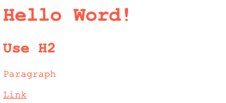

## CSS

### Introduction a CSS

1. Selector:  Define a que elemento le vamos a agregar estilos.

```css
h2 {
}
```

2. Propiedad: es la caracteristica de un elemento. Por ejemplo: color, size o margin.
```css
h2 {
  color:
}
```

3. Valor: es lo que define a la propiedad.

```css
h2 {
  color: red
}
```

* Estilos en Línea
```html
<h2 style="color: blue; border: 1 px solid red">Hello World!</h2>
```

* Uso de la Etiqueta `style`
```html
  <style>
    h2 {
      color: red
    }
  </style>

  <h2>Hello World!</h2>
```

* Uso de file `*.css`
```css
h2 {
  color: red;
  border: 1px solid black;
}
```


`index.html`
```html
  <head>
    <link rel="stylesheet" href="./style.css" />
  </head>
```

* Comentarios en CSS
```css
/*
  comments
*/
```

* Selectores
1. Selector de tipo etiqueta
`h2 {}`

2. Selector de tipo class
`.title {}`

3. Selector de tipo id
`#title {}`

4. Selector universal
`* {}`

* Selectores Combinadores
```html
<div class="primary">
  <div class="secondary">
    <h2 class="title">Inside 2H2</h2>
  </div>
  <h2 class="title">OutSide  1H2</h2>
</div>
```

1. Combinador de descendiente ( )space: realiza cambios en todas etiquetas que se encuentren dentro

```css
.primary .title {
  color: green;
  font-size: 50px;
}
```


2. Combinador de hijos directos (>):

```css
.primary > .title {
  color: green;
  font-size: 40px;
}
```


### Herencia, Cascada y Especificidad
1. Cascada: Define que estilo va a predominar en caso de haber mas de un selector que cambie los estilos de mas de un elemento. Los ultimos estilos sobreescribiran a los primeros.

```html
<h2 class="title">Hello Word!</h2>
```

```css
.title {
  color: red;
}

.title {
  color: green;
}
```


2. Especificidad: Define que estilos se aplicaran por quien tiene mas importancia. Es el valor que se le da a los selectores en CSS.

```html
<body>
  <div class="content">
    <h2 id="title" class="title">Hello Word!</h2>
  </div>
</body>
```

**001** - Selector de tipo o etiqueta, Pseudoelementos `::`

```css
h2 {
  color: green;
}
```


**010** - Selector de clase, Pseudoclases `:, []`
```css
.title {
  color: red;
}

h2 {
  color: green;
}
```


**100** - Selector de Id
```css
#title {
  color: brown;
}

.title {
  color: red;
}

h2 {
  color: green;
}
```


2.1 Especificidad con selectores combinados

**011**
```css
body .title {
  color: dodgerblue;
}
```

**110**
```css
.content > #title {
  color: yellow;
}
```

*Nota: Cuando hay empate en especificidad se aplica la cascada. Es mas recomendable tener la especificidad al minimo, como usar `class`.*

Para aplicar estilos en selectores de menor especificidad podemos utilizar la propiedad `!important`

```css
#title {
  color: brown;
}

.title {
  color: yellow !important;
}
```


*Nota: No es recomendable utilizar `!important`, siguiendo que es la recomendación de tener la especificidad al minimo. Se recomineda cuando debemos aplicar estilo a etiqueta que tiene estilo en linea `<h2 style="color: blue;">Hello World!</h2>` el cual es mas imporartante que cualquier selector.*

1. Herencia: En CSS se heredan por defecto estilos a los hijos de un contenedor. Por ejemplo la propiedad `font-family`.
```html
<body>
  <h1 id="title" class="title">Hello Word!</h1>
  <h2>Use H2</h2>
  <p>Paragraph</p>
  <a href="#">Link</a>
</body>
```

```css
body {
  font-family: 'Courier New', Courier, monospace;
  color: tomato;
}
```


*Nota: Hay algunos etiquetas que tienen propiedades con valores por defecto como la etiqueta `a`, para heredar el valor de la etiqueta padre o contendora podemos utilizar el valor. En resumen no todas las propiedades se heredan automanticamente. Para saber si un elemento es herdable podemos inspecsionar desde el navegador*

```css
body {
  font-family: 'Courier New', Courier, monospace;
  color: tomato;
}

a {
  color: inherit;
}
```


