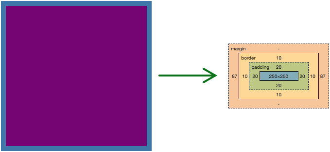
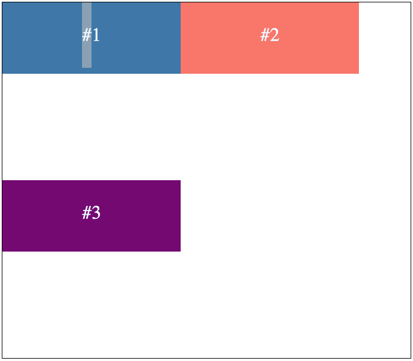
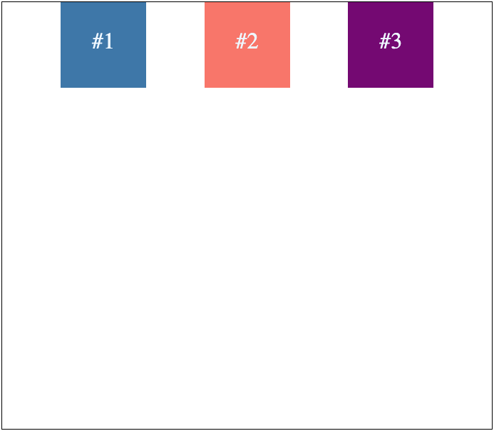

## CSS

### Introduction a CSS

1. Selector:  Define a que elemento le vamos a agregar estilos.

```css
h2 {
}
```

2. Propiedad: es la caracteristica de un elemento. Por ejemplo: color, size o margin.
```css
h2 {
  color:
}
```

3. Valor: es lo que define a la propiedad.

```css
h2 {
  color: red
}
```

* Estilos en Línea
```html
<h2 style="color: blue; border: 1 px solid red">Hello World!</h2>
```

* Uso de la Etiqueta `style`
```html
  <style>
    h2 {
      color: red
    }
  </style>

  <h2>Hello World!</h2>
```

* Uso de file `*.css`
```css
h2 {
  color: red;
  border: 1px solid black;
}
```


`index.html`
```html
  <head>
    <link rel="stylesheet" href="./style.css" />
  </head>
```

* Comentarios en CSS
```css
/*
  comments
*/
```

* Selectores
1. Selector de tipo etiqueta
`h2 {}`

2. Selector de tipo class
`.title {}`

3. Selector de tipo id
`#title {}`

4. Selector universal
`* {}`

* Selectores Combinadores
```html
<div class="primary">
  <div class="secondary">
    <h2 class="title">Inside 2H2</h2>
  </div>
  <h2 class="title">OutSide  1H2</h2>
</div>
```

1. Combinador de descendiente ( )space: realiza cambios en todas etiquetas que se encuentren dentro

```css
.primary .title {
  color: green;
  font-size: 50px;
}
```


2. Combinador de hijos directos (>):

```css
.primary > .title {
  color: green;
  font-size: 40px;
}
```


### Herencia, Cascada y Especificidad
1. Cascada: Define que estilo va a predominar en caso de haber mas de un selector que cambie los estilos de mas de un elemento. Los ultimos estilos sobreescribiran a los primeros.

```html
<h2 class="title">Hello Word!</h2>
```

```css
.title {
  color: red;
}

.title {
  color: green;
}
```


2. Especificidad: Define que estilos se aplicaran por quien tiene mas importancia. Es el valor que se le da a los selectores en CSS.

```html
<body>
  <div class="content">
    <h2 id="title" class="title">Hello Word!</h2>
  </div>
</body>
```

**001** - Selector de tipo o etiqueta, Pseudoelementos `::`

```css
h2 {
  color: green;
}
```


**010** - Selector de clase, Pseudoclases `:, []`
```css
.title {
  color: red;
}

h2 {
  color: green;
}
```


**100** - Selector de Id
```css
#title {
  color: brown;
}

.title {
  color: red;
}

h2 {
  color: green;
}
```


2.1 Especificidad con selectores combinados

**011**
```css
body .title {
  color: dodgerblue;
}
```

**110**
```css
.content > #title {
  color: yellow;
}
```

*Nota: Cuando hay empate en especificidad se aplica la cascada. Es mas recomendable tener la especificidad al minimo, como usar `class`.*

Para aplicar estilos en selectores de menor especificidad podemos utilizar la propiedad `!important`

```css
#title {
  color: brown;
}

.title {
  color: yellow !important;
}
```


*Nota: No es recomendable utilizar `!important`, siguiendo que es la recomendación de tener la especificidad al minimo. Se recomineda cuando debemos aplicar estilo a etiqueta que tiene estilo en linea `<h2 style="color: blue;">Hello World!</h2>` el cual es mas imporartante que cualquier selector.*

1. Herencia: En CSS se heredan por defecto estilos a los hijos de un contenedor. Por ejemplo la propiedad `font-family`.
```html
<body>
  <h1 id="title" class="title">Hello Word!</h1>
  <h2>Use H2</h2>
  <p>Paragraph</p>
  <a href="#">Link</a>
</body>
```

```css
body {
  font-family: 'Courier New', Courier, monospace;
  color: tomato;
}
```


*Nota: Hay algunos etiquetas que tienen propiedades con valores por defecto como la etiqueta `a`, para heredar el valor de la etiqueta padre o contendora podemos utilizar el valor. En resumen no todas las propiedades se heredan automanticamente. Para saber si un elemento es herdable podemos inspecsionar desde el navegador*

```css
body {
  font-family: 'Courier New', Courier, monospace;
  color: tomato;
}

a {
  color: inherit;
}
```

content


### Box Model
Todos elementos son tratados como cajas. Esto lleva al box model el cual se divide en capas. Cada capa nos permite manipular una caracteristica de las cajas en CSS.

```html
<body>
  <div class="box">Hello World!. AD LOREM IPSUM GENERADOR Lorem ipsum dolor sit amet.</div>
</body>
```

1. content: Permite que aparezca en el navegador
```css
.box {   
  background-color: yellow;
  width: 200px;
  height: 200px;
}
```


2. **padding**: Permite crear un espacio entre el borde y el contenido. Modifica el tamaño del elemento.
```css
.box {   
  background-color: steelblue;
  width: 200px;
  height: 200px;
  padding: 30px;
  /*
  padding-top: 30px;
  padding-right: 20px;
  padding-bottom: 10px;
  padding-left: 25px;
  */
}
```

2.1 shorthand `padding` toma el sentido de la manecillas del reloj `top right bottom left`.
`padding: 30px 20px 10px 20px;`

Cuando se definen dos valores a la propiedad. Toma el primer valor para definir `top bottom` y el segundo para `right left`.
```css
.box {   
  background-color: steelblue;
  width: 200px;
  height: 200px;
  padding: 30px 20px;
}
```


Cuando se definen tres valores `top right bottom`, el cuarto valor lo tamaría de su contrario que es `right`.
```css
.box {   
  background-color: steelblue;
  width: 200px;
  height: 200px;
  padding: 30px 10px 15px;
}
```


3. **border**: Permite definir la linea de borde del elemento. Modifica el tamaño del elemento. Es la ultima que lo modifica.
```css
.box {   
  background-color: steelblue;
  width: 200px;
  height: 200px;
  padding: 30px;
  border-color: red;
  border-width: 10px;
  border-style: solid;
}
```

3.1 **border-width**: Define el ancho del borde. Al igual que el `padding`, es un shorthand toma el sentido de la manecillas del reloj `top right bottom left`. Por ejemplo: `border-width: 20px 10px 30px 15px;`. Tambien se compone de cuatro propiedades:
```css
.box {   
  background-color: steelblue;
  width: 200px;
  height: 200px;
  padding: 30px;
  border-color: red;
  border-style: solid;
  border-top-width: 25px; /* define ancho para el borde de arriba */
  border-right-width: 10px; /* define ancho para el borde de la derecha */
  border-bottom-width: 20px; /* define ancho para el borde de la izquierda */
  border-left-width: 15px; /* define ancho para el borde de abajo */
}
```


3.2 **border-style**: Define los estilos de linea del borde. Igualmente es un shorthand toma el sentido de la manecillas del reloj `top right bottom left`. . Por ejemplo: `border-style: double dashed groove dotted;`. Tambien se compone de cuatro propiedades:

```css
.box {   
  background-color: steelblue;
  width: 200px;
  height: 200px;
  padding: 30px 10px 15px;
  border-color: red;
  border-width: 10px;
  border-top-style: double;
  border-right-style: dashed;
  border-bottom-style: groove;
  border-left-style: dotted;
}
```


3.3 **border-color**: Define los estilos de color del borde. Igualmente es un shorthand toma el sentido de la manecillas del reloj `top right bottom left`. . Por ejemplo: `border-color: red yellow green purple;`. Tambien se compone de cuatro propiedades:
```css
.box {   
  background-color: steelblue;
  width: 200px;
  height: 200px;
  padding: 30px 10px 15px;
  border-style: solid;
  border-width: 10px;
  border-top-color: red;
  border-right-color:  yellow;
  border-bottom-color: green;
  border-left-color: purple;
}
```


3.4 shorthand **border** `border: red 10px solid;` No importa el orden.


4. **margin**: Es la capa externa del elemento. No modifica el tamaño del elemento.

```html
<body>
  <div class="box">Hello World!. AD LOREM IPSUM GENERADOR Lorem ipsum dolor sit amet.</div>
  <div class="box box-1">Hello World!. AD LOREM IPSUM GENERADOR Lorem ipsum dolor sit amet.</div>
</body>
```

```css
.box {
  background-color: steelblue;
  width: 150px;
  height: 150px;
  padding: 10px;
  border-style: solid;
  border-width: 10px;
  border-color: red;
}

.box-1 {
  margin: 80px;
}
```

4.1 shorthand `margin` toma el sentido de la manecillas del reloj `top right bottom left`. `margin: 20px 10px 10px 10px;`. Tambien se compone de cuatro propiedades:
```css
.box-1 {
  margin-top: 20px;
  margin-right: 10px;
  margin-bottom: 10px;
  margin-left: 10px;
}
```

En `margin` se aplican las misma reglas que en `padding` encuanto shorthand.
*Nota: margin acepta el valor `auto`, pero solo funciona de manera horizontal. para las propiedades margin-top y margin-bottom, no toman el valor `auto`. Para centrar se asignan valores verticales: `margin: 0 auto;`*


4.2 Los colapsos de margenes se dan entre `margin-top` y `margin-bottom`.
Se recomienda tener una capa (`padding`, `border`) entre un parent y child elemento, mas que todo en el parent.
```html
<body>
  <main class="main">
    <h2 class="title">Use H2</h2>
  </main>
  <footer class="footer">
    <h2>Footer</h2>
  </footer>
</body>
```
```css
.main {
  background-color: blue;
  color: aliceblue;
  margin-bottom: 50px;
  border: 1px black solid; /* fix colapso de margenes*/
}

.title {
  margin-top: 40px;
}

.footer {
  background-color: red;
  color: aliceblue;
  margin-top: 50px;
}
```


### Box-Sizing
Define el comportamiento de las cajas. por defecto es `box-sizing: content-box;` no toma como tamaño final `width` y `height`, sino como tamaño la capa de contenido, tambien el `border` y el `padding`.

```html
<div class="element"></div>
```

```css
.element {
  box-sizing: content-box;
  width: 250px;
  height: 250px;
  background-color: purple;
  border: 10px steelblue solid;
  padding: 20px;
  margin: 0 auto;
}
```



* border-box: asigna primero valores border, padding y lo que sobre se lo dará al contenido.

```css
.element {
  box-sizing: border-box;
  width: 250px;
  height: 250px;
  background-color: purple;
  border: 10px steelblue solid;
  padding: 20px;
  margin: 0 auto;
}
```


Si queremos aplicar border-box a todos los elementos podemos utlizar el selector universal `* {}`

### Position
La propiedad `position` in CSS establece cómo se posiciona un elemento en un documento. Las propiedades `top`, `right`, `bottom` y `left` determinan la posición final del elemento.

```html
<body>
  <div class="square"></div>
  <div class="rectangle"></div>
</body>
```

* **static** El elemento se posiciona según el flujo normal del documento. Las propiedades `top`, `right`, `bottom`, `left` y `z-index` no tienen efecto. Este es el valor por defecto.
```css
.square {
  width: 200px;
  height: 200px;
  background-color: steelblue;
  position: static;
  left: 20px;
}

.rectangle {
  width: 400px;
  height: 200px;
  background-color: red;
  margin-top: 5px;
}
```


* **relative** El elemento se posiciona según el flujo normal del documento, y luego se desplaza respecto a sí mismo en función de los valores de `top`, `right`, `bottom` y `left`. El desplazamiento no afecta a la posición de ningún otro elemento; por lo tanto, el espacio dado al elemento en el diseño de la página es el mismo que si la posición fuera estática.

```css
.square {
  width: 200px;
  height: 200px;
  background-color: steelblue;
  position: relative;
  left: 100px;
  top: 50px;
}

.rectangle {
  width: 400px;
  height: 200px;
  background-color: red;
  margin-top: 5px;
}
```


* **absolute** El elemento se elimina del flujo normal del documento y no se crea ningún espacio para él en el diseño de página. Se posiciona en relación a su ancestro posicionado más cercano, si existe; de lo contrario, se posiciona en relación al bloque contenedor inicial. Su posición final viene determinada por los valores de `top`, `right`, `bottom` y `left`.

Para este ejemplo el circulo se posiciona en base a su contenedor que es el `body`.
```html
<body>
  <div class="square"></div>
  <div class="circle"></div>
</body>
```

```css
.square {
  width: 200px;
  height: 200px;
  background-color: steelblue;
  position: relative;
  left: 150px;
}

.circle {
  width: 20px;
  height: 20px;
  background-color: red;
  border-radius: 50%;
  position: absolute;
  left: 0;
  top: 0;
}
```


Si queremos que el circulo se posicione dentro del cuadrado.
```html
<body>
  <div class="square">
    <div class="circle"></div>
  </div>
</body>
```


* **fixed** El elemento se elimina del flujo normal del documento y no se crea ningún espacio para él en el diseño de la página. Se posiciona en relación con el bloque contenedor inicial establecido por la viewport. Su posición final viene determinada por los valores de `top`, `right`, `bottom` y `left`.

```html
<body>
  <div class="square"></div>
  <div class="rectangle"></div>
  <div class="rectangle"></div>
</body>
```

```css
.square {
  width: 200px;
  height: 200px;
  background-color: steelblue;
  position: fixed;
  left: 110px;
  top: 50px;
}

.rectangle {
  width: 400px;
  height: 400px;
  background-color: red;
}
```


* **sticky** El elemento se posiciona de acuerdo con el flujo normal del documento y, a continuación, se desplaza con respecto a su ancestro de desplazamiento más cercano y al bloque que lo contiene (ancestro a nivel de bloque más cercano), incluidos los elementos relacionados con tablas, en función de los valores de `top`, `right`, `bottom` y `left`. El desplazamiento no afecta a la posición de ningún otro elemento.

```html
<body>
  <div class="rectangle">other 0</div>
  <div class="square">sticky 0</div>
  <div class="rectangle">other 1</div>
  <div class="rectangle">other 2</div>
  <div class="rectangle">other 3</div>
  <div class="square">sticky 1</div>
  <div class="rectangle">other 4</div>
  <div class="rectangle">other 5</div>
  <div class="rectangle">other 6</div>
</body>
```

```css
.square {
  width: 400px;
  height: 50px;
  background-color: steelblue;
  position: sticky;
  top: 0;
}

.rectangle {
  width: 400px;
  height: 200px;
  background-color: red;
}
```


### Display
La propiedad CSS display establece si un elemento se trata como un elemento de `block` o `inline` y el diseño utilizado para sus hijos, como flow layout, `grid` o `flex`.
la propiedad `display` establece los tipos de visualización interior y exterior de un elemento. El tipo externo establece la participación de un elemento en la disposición de flujo; el tipo interno establece la disposición de los elementos hijos.

##### Exterior
* **block** El elemento genera una caja de elemento de bloque, generando saltos de línea tanto antes como después del elemento cuando está en el flujo normal. Los elementos ocupan el 100% del ancho. Esta dado por defecto. Estos son algunos de los elementos que tienen por defecto `block`. `div`, `hr`, `p`, `h1...h6`, `table`, `canvas` entre otros.

```html
<body>
  <div class="square"></div>
  <div class="square"></div>
  <div class="square"></div>
</body>
```

```css
.square {
  width: 100px;
  height: 100px;
  background-color: steelblue;
  margin-top: 5px;
}
```


* **inline** Los elementos `inline` no admiten dimensiones (`width`, `height`), pero si admiten `margin`, `padding` y `border`, solo ocupan lo que tengan en su contenido. Estos son algunos de los elementos que tienen por defecto `inline`. `a`, `span`, `img`, `b`, `small`, `sub`, `sup` entre otros.

```html
<body>
  <a href="#">Link a</a>
  <span>Use Span</span>
  <a href="#">Link b</a>
</body>
```

```css
a {
  background-color: aqua;
  padding: 5px;
}

span {
  color: red;
  margin: 0 20px;
}
```


*Nota: La única razón por la que tenemos esas diferencias entre los distintos tipos de elementos HTML (block vs inline) es porque el navegador carga su propio CSS.*

* **inline-block** Es una combinación entre los dos tipos de elementos mencionados anteriormente (block e inline), los elementos con el valor inline-block admiten dimensiones pero todavía son elementos de línea, es decir estarán colocados uno al lado de otro.

```html
<body>
  <a href="#">Link a</a>
  <span>Use Span</span>
  <a href="#">Link b</a>
</body>
```

```css
a {
  background-color: aqua;
  padding: 5px;
  display: inline-block;
  width: 150px;
}

span {
  color: red;
  margin: 0 20px;
  display: inline-block;
  width: 100px;
}
```


* **none** Desactiva la visualización de un elemento para que no tenga ningún efecto sobre el diseño (el documento se renderiza como si el elemento no existiera).

```html
<body>
  <a href="#">Link a</a>
  <span>Use Span</span>
  <a href="#">Link b</a>
</body>
```

```css
a {
  background-color: aqua;
  padding: 5px;
  display: inline;
}

span {
  color: red;
  margin: 0 20px;
  display: none;
  width: 100px;
}
```


##### Interior
Los últimos valores mas importantes de la propiedad display es `grid` y `flex`.

### Flexbox
El módulo Flexible Box Layout facilita el diseño de una estructura de diseño flexible y adaptable sin necesidad de utilizar flotadores ni posicionadores. Flexbox es un módulo completo y no una sola propiedad, que implica un montón de cosas, incluyendo todo su conjunto de propiedades. Algunos de ellos deben establecerse en el contenedor (elemento padre, denominado "contenedor flexible"), mientras que otros deben establecerse en los elementos hijos (denominados "elementos flexibles"). Los elementos se dispondrán siguiendo main axis (principal) o cross axis (secundario)
`display: flex;`

##### Flexbox properties
* `flex-direction` define en qué dirección el contenedor quiere apilar los elementos flex. Piensa que los elementos flexibles se disponen principalmente en rows horizontales o columns verticales.

```html
<div class="container">
  <div class="item item1">#1</div>
  <div class="item item2">#2</div>
  <div class="item item3">#3</div>
</div>
```

```css
*{
  box-sizing: border-box;
}

.container {
  width: 90%;
  max-width: 800px;
  min-height: 600px;
  margin: 80px auto;
  border: 1px solid black;
}

.item {
  width: 120px;
  height: 120px;
  color: aliceblue;
  font-size: 2rem;
  text-align: center;
  line-height: 110px;
}

.item1 {
  background-color: steelblue;
}

.item2 {
  background-color: salmon;
}

.item3 {
  background-color: purple;
}
```

* **row** (por defecto): de izquierda a derecha en 'ltr'; de derecha a izquierda en 'rtl'

```css
.container {
  width: 90%;
  max-width: 800px;
  min-height: 600px;
  margin: 80px auto;
  border: 1px solid black;
  display: flex;
  flex-direction: row;
}
```


* **row-reverse**: de derecha a izquierda en 'ltr'; de izquierda a derecha en 'rtl'

```css
.container {
  width: 90%;
  max-width: 800px;
  min-height: 600px;
  margin: 80px auto;
  border: 1px solid black;
  display: flex;
  flex-direction: row-reverse;
}
```


* **column**: igual que `row` pero de arriba a abajo

```css
.container {
  width: 90%;
  max-width: 800px;
  min-height: 600px;
  margin: 80px auto;
  border: 1px solid black;
  display: flex;
  flex-direction: column;
}
```


* **column-reverse**: igual que `row-reverse` pero de abajo a arriba

```css
.container {
  width: 90%;
  max-width: 800px;
  min-height: 600px;
  margin: 80px auto;
  border: 1px solid black;
  display: flex;
  flex-direction: column-reverse;
}
```


* `flex-wrap` especifica si los elementos flex deben envolverse o no.
Para los ejemplos se aumenta el `width: 300px;` de los items.

```css
.item {
  width: 300px;
  height: 120px;
  color: aliceblue;
  font-size: 2rem;
  text-align: center;
  line-height: 110px;
}
```

* **nowrap** (por defecto): todos los elementos flex estarán en una línea. Si los elementos soprepasan los elementos del main axis, estos reducen su tamaño.

```css
.container {
  width: 90%;
  max-width: 800px;
  min-height: 600px;
  margin: 80px auto;
  border: 1px solid black;
  display: flex;
  flex-wrap: nowrap;
}
```


* **wrap**: los elementos flex se envolverán en varias líneas, de arriba a abajo.

```css
.container {
  width: 90%;
  max-width: 800px;
  min-height: 600px;
  margin: 80px auto;
  border: 1px solid black;
  display: flex;
  flex-wrap: wrap;
}
```



* **wrap-reverse**: los elementos flex se envolverán en varias líneas, de abajo a arriba.

```css
.container {
  width: 90%;
  max-width: 800px;
  min-height: 600px;
  margin: 80px auto;
  border: 1px solid black;
  display: flex;
  flex-wrap: wrap-reverse;
}
```


* `flex-flow` es una propiedad abreviada para establecer las propiedades `flex-direction` y `flex-wrap`.

```css
.container {
  display: flex;
  flex-flow: row wrap;
}
```

* `justify-content` define la alineación a lo largo del main axis. Ayuda a distribuir el espacio libre sobrante.

* **flex-start** (por defecto): los elementos se colocan hacia el principio del `flex-direction`.

```css
.container {
  width: 90%;
  max-width: 800px;
  min-height: 600px;
  margin: 80px auto;
  border: 1px solid black;
  display: flex;
  justify-content: flex-start;
}
```


* **flex-end**: los elementos se colocan hacia el final del `flex-direction`.

```css
.container {
  width: 90%;
  max-width: 800px;
  min-height: 600px;
  margin: 80px auto;
  border: 1px solid black;
  display: flex;
  justify-content: flex-end;
}
```


* **center *: los elementos se centran a lo largo de la línea

```css
.container {
  width: 90%;
  max-width: 800px;
  min-height: 600px;
  margin: 80px auto;
  border: 1px solid black;
  display: flex;
  justify-content: center;
}
```


* **space-between**: los elementos se distribuyen uniformemente en la línea; el primer elemento está en la línea de inicio, el último en la línea final.

```css
.container {
  width: 90%;
  max-width: 800px;
  min-height: 600px;
  margin: 80px auto;
  border: 1px solid black;
  display: flex;
  justify-content: space-between;
}
```


* **space-around**: los elememtos están distribuidos uniformemente en la línea con el mismo espacio a su alrededor. Tenga en cuenta que visualmente los espacios no son iguales, ya que todos los elementos tienen el mismo espacio a ambos lados.

```css
.container {
  width: 90%;
  max-width: 800px;
  min-height: 600px;
  margin: 80px auto;
  border: 1px solid black;
  display: flex;
  justify-content: space-around;
}
```


* **space-evenly**: los elementos se distribuyen de modo que el espacio entre dos elementos cualesquiera es igual.

```css
.container {
  width: 90%;
  max-width: 800px;
  min-height: 600px;
  margin: 80px auto;
  border: 1px solid black;
  display: flex;
  justify-content: space-evenly;
}
```



* `align-items` define la alineación a lo largo del cross axis.

* **stretch** (por defecto): estirar hasta llenar el contenedor (respetando min-ancho/máx-ancho). No se debe tener valor definido la propiedad `height` cuando el *flex-direction* es `row` y `width` para cuando el *flex-direction* es `column`.

Para los ejemplos se aumenta el `width: 300px;` de los items.

```css
.container {
  width: 90%;
  max-width: 800px;
  min-height: 600px;
  margin: 80px auto;
  border: 1px solid black;
  display: flex;
  align-items: stretch;
```

```css
.item {
  width: 300px;
  color: aliceblue;
  font-size: 2rem;
  text-align: center;
  line-height: 110px;
}
```


* **flex-start**: los elementos se colocan al principio del cross axis.

```css
.container {
  width: 90%;
  max-width: 800px;
  min-height: 600px;
  margin: 80px auto;
  border: 1px solid black;
  display: flex;
  align-items: flex-start;
```


* **flex-end**: los elementos se colocan al final del cross axis.

```css
.container {
  width: 90%;
  max-width: 800px;
  min-height: 600px;
  margin: 80px auto;
  border: 1px solid black;
  display: flex;
  align-items: flex-end;
```


* **center**:: los elementos se centran en el cross axis.

```css
.container {
  width: 90%;
  max-width: 800px;
  min-height: 600px;
  margin: 80px auto;
  border: 1px solid black;
  display: flex;
  align-items: center;
```


* **baseline**: los elementos se alinean de tal forma que sus líneas de base se alinean. Se alinean en base de linea inferior de los texto.

```css
.container {
  width: 90%;
  max-width: 800px;
  min-height: 600px;
  margin: 80px auto;
  border: 1px solid black;
  display: flex;
  align-items: baseline;
```


* `align-content` Modifica el comportamiento de la propiedad `flex-wrap`.

```css
.container {
  align-content: flex-start | flex-end | center | space-between | space-around | space-evenly | stretch | start | end | baseline ...;
```

**Nota**: Esta propiedad sólo tiene efecto en los contenedores flexibles multilínea, en los que `flex-wrap` está configurado como `wrap` o `wrap-reverse`.

```css
.container {
  width: 90%;
  max-width: 800px;
  min-height: 600px;
  margin: 80px auto;
  border: 1px solid black;
  display: flex;
  flex-wrap: wrap;
  align-content: space-between;
}
```


